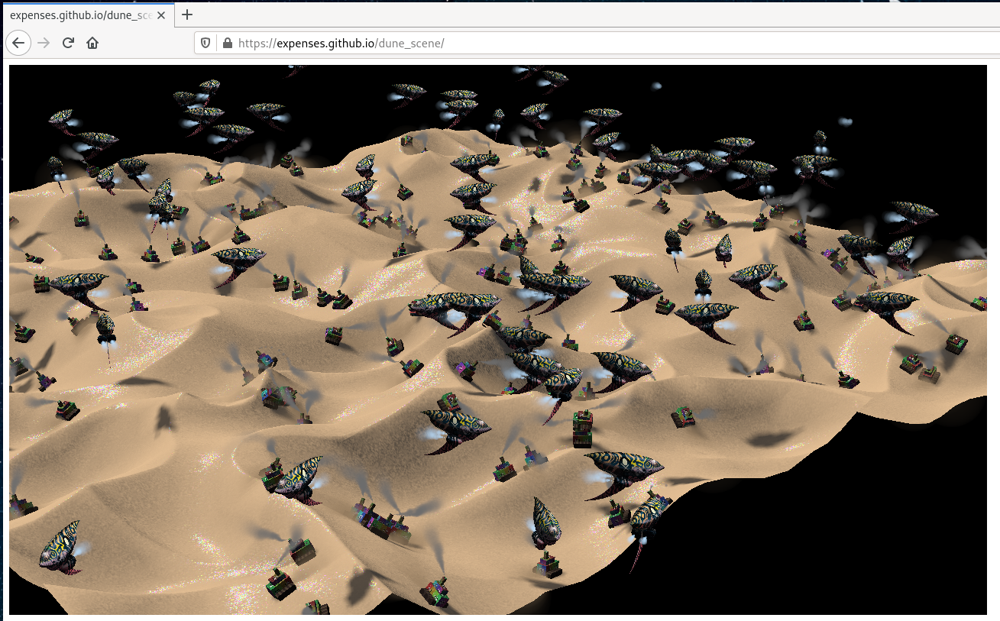

Works on Firefox Nightly 2021-03-02 [with WebGPU support enabled](https://github.com/gpuweb/gpuweb/wiki/Implementation-Status) and possibly earlier, but not later versions.
Might work on Chrome Canary too, haven't tested it though.
